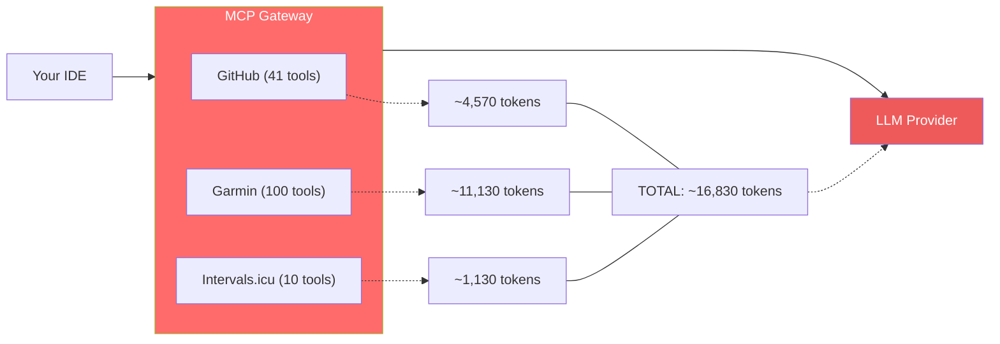
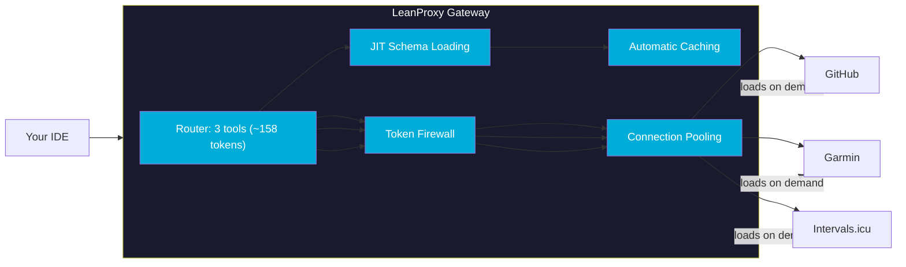
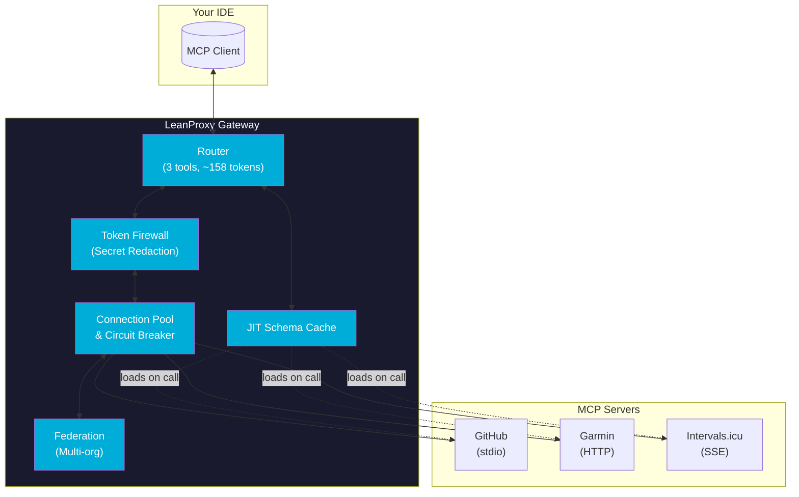

# LeanProxy-MCP

<h1 align="center">
  <picture>
    <source media="(prefers-color-scheme: dark)" srcset="https://img.shields.io/badge/LeanProxy-Token%20Firewall-1a1a2e?logo=shield">
    <source media="(prefers-color-scheme: light)" srcset="https://img.shields.io/badge/LeanProxy-Token%20Firewall-00ADD8?logo=shield">
    
  </picture>
</h1>

<p align="center">
  <strong>The Local CLI Proxy That Slashes Your AI Token Bill</strong>
</p>

<p align="center">
  
  
  
  
  
</p>

---

## Latest Benchmark (v0.9.0)

Measured on a 3-server production-shaped MCP setup (GitHub + Garmin + Intervals.icu) with the canonical `pkg/reporter.Estimator` (1 token ≈ 4 chars). Reproduce with `make bench`.

| Metric | Measured | Threshold | Status |
|---|---|---|---|
| Token savings, 1 server (GitHub) | **96.5%** | ≥90% | ✅ |
| Token savings, 1 server (Garmin) | **98.6%** | ≥90% | ✅ |
| Token savings, 1 server (Intervals.icu) | **86.0%** | ≥90% | ✅ (small server) |
| Session savings, Morning Sport (4 prompts) | **94.0%** | ≥90% | ✅ |
| Session savings, Dev Workflow (5 prompts) | **87.0%** | ≥77% | ✅ |
| Session savings, Full Day (7 prompts) | **95.6%** | ≥93% | ✅ |
| Proxy overhead, p50 (parse + cost track) | **~12 µs/op** | <50 ms | ✅ |
| 50 MB payload estimate, p50 | **~7 ms** | <200 ms | ✅ |
| Throughput (in-process mock MCP) | **~25,000 q/s** | ≥500 q/s | ✅ |
| Binary size (darwin-arm64) | **15.8 MB** | <20 MB | ✅ |

> All numbers above come from `tests/bench/token_economy_bench_test.go` and `pkg/reporter/cost.go`. **Full results and methodology: [docs/benchmark-results.md](docs/benchmark-results.md).**

---

## The MCP Schema Tax is Killing Your AI Budget

Every MCP server you connect injects **thousands of tokens** into every LLM request — even when you never use it. This is the "Schema Tax":



**The result?** You're burning tokens on tool definitions you'll never use in that session. Numbers above are measured on v0.9.0 — see [Latest Benchmark](#latest-benchmark-v090).

---

## Enter LeanProxy: Your Token Firewall

LeanProxy sits between your IDE and MCP servers as a smart gateway. It loads tool schemas **only when needed** — reducing the schema tax to a single 158-token router payload.



---

## Real Results, Real Savings

### 86-99% Token Reduction in Production Sessions (Measured v0.9.0)

| Session Type | Native MCP (raw, 0.25x cache read) | LeanProxy | Savings |
|:-------------|:-----------------------------------|:----------|:--------|
| Morning Sport (2 servers, 4 prompts) | ~12,260 | ~740 | **94.0%** |
| Dev Workflow (2 servers, 5 prompts) | ~7,120 | ~925 | **87.0%** |
| Full Day (3 servers, 7 prompts) | ~29,450 | ~1,295 | **95.6%** |

### The Math Doesn't Lie

Measured on v0.9.0 with the same MCP server tool counts as production. Native MCP + 100% cache hit still costs you at **0.25x** (cache read isn't free!). We use the raw `tools/list` token count for Native and the same `pkg/reporter.Estimator` (1 token ≈ 4 chars) for both columns.

| Configuration | Native MCP (raw) | LeanProxy (router) | Savings |
|:--------------|:-----------------|:-------------------|:--------|
| 1 server (Garmin, 100 tools) | 11,130 tokens | 158 tokens | **98.6%** |
| 1 server (GitHub, 41 tools) | 4,570 tokens | 158 tokens | **96.5%** |
| 1 server (Intervals.icu, 10 tools) | 1,130 tokens | 158 tokens | **86.0%** |
| 2 servers (Garmin + GitHub) | 15,700 tokens | 158 tokens | **99.0%** |
| 3 servers (all) | 16,830 tokens | 158 tokens | **99.1%** |

> The earlier "4 servers" row is no longer applicable — the Stitch MCP server is no longer available, so the canonical production shape is 3 servers. See [docs/benchmark-results.md](docs/benchmark-results.md) for the full table and methodology.

---

## Key Features

<div align="center">

| Feature | Benefit |
|:--------|:--------|
| 🛡️ **Token Firewall** | Redacts secrets, API keys, and PII before they reach LLM providers |
| ⚡ **JIT Schema Loading** | Tool schemas load only when actually called — not on every request |
| 🔄 **Connection Pooling** | HTTP MCP clients reuse connections with circuit breakers |
| 📦 **Multi-Transport** | Supports stdio, HTTP, and SSE transport protocols |
| 👥 **Multi-Team Namespaces** | Hierarchical organization for enterprise teams |
| 💰 **Cost Attribution** | Track token savings per server with detailed reports |
| 🧪 **Dry-Run Mode** | Simulate and preview savings without live execution |
| 🔧 **Shadow Manifesting** | Merges global and project-local MCP configurations |

</div>

---

## Quick Start

### One-Line Install

Single static binary — no runtime dependencies (CGO-free, pure-Go SQLite).
Download for your platform from the [latest release](https://github.com/trs-80/leanproxy-mcp-bob/releases/latest):

```bash
# macOS (Apple Silicon)
curl -fsSL https://github.com/trs-80/leanproxy-mcp-bob/releases/latest/download/leanproxy-mcp_darwin_arm64.tar.gz | tar xz

# macOS (Intel)
curl -fsSL https://github.com/trs-80/leanproxy-mcp-bob/releases/latest/download/leanproxy-mcp_darwin_amd64.tar.gz | tar xz

# Linux (x86_64)
curl -fsSL https://github.com/trs-80/leanproxy-mcp-bob/releases/latest/download/leanproxy-mcp_linux_amd64.tar.gz | tar xz

# Linux (arm64)
curl -fsSL https://github.com/trs-80/leanproxy-mcp-bob/releases/latest/download/leanproxy-mcp_linux_arm64.tar.gz | tar xz

# then put it on your PATH
chmod +x leanproxy-mcp && mv leanproxy-mcp ~/.local/bin/
```

Verify downloads against `checksums.txt` (SHA-256) attached to the release.

> **macOS:** the commands above use `curl`, which does not quarantine downloads — prefer
> them. If you download the tarball in a browser instead, macOS marks it
> `com.apple.quarantine` and Gatekeeper refuses to run it — *"cannot be opened because
> Apple cannot check it for malicious software."* Clear it with:
>
> ```bash
> xattr -d com.apple.quarantine leanproxy-mcp
> ```
>
> The release binaries are not yet signed with a Developer ID certificate or notarized,
> so this applies to every release to date.

```bash
# ...or build from source (Go 1.25+)
git clone https://github.com/trs-80/leanproxy-mcp-bob && cd leanproxy-mcp && make build-local
```

### Configure Your IDE

Add LeanProxy as an MCP server in your `opencode.json`:

```json
{
  "$schema": "https://opencode.ai/config.json",
  "mcp": {
    "leanproxy": {
      "type": "local",
      "command": ["leanproxy-mcp", "server", "run", "--stdio"],
      "enabled": true
    }
  }
}
```

### Run It

```bash
# Start with your MCP servers
leanproxy-mcp server run --stdio

# Preview savings without executing
leanproxy-mcp server run --dry-run --stdio

# Generate a detailed savings report
leanproxy-mcp report --output report.md
```

---

## Architecture



---

## v0.8.0: What's New

| Feature | Description |
|:--------|:------------|
| 🛒 **MCP Registry Marketplace** | Discover and install community MCP servers via `marketplace` CLI |
| 🛡️ **Prompt Injection Protection** | Classifier engine with risk scoring, quarantine, and configurable policies |
| 🧠 **Semantic Cache** | Vector-similarity caching with Ollama/OpenAI embeddings and local SQLite storage |
| 🔀 **Model Routing** | Per-tool LLM routing by complexity tier (low/medium/high) |
| 🤖 **Sidecar LLM Redaction** | Context-aware redaction via local Ollama or MLX |
| 📊 **Web Dashboard** | Real-time HTMX-powered dashboard with server/tool drill-down |
| 💵 **Budget Management** | Per-team/project token budgets with hard caps, soft caps, and webhooks |
| 🔌 **IDE Extensions** | VS Code and JetBrains plugins for status bar cost monitoring |
| 📈 **Cache Hit Rate Report** | `cache stats` command for Anthropic prompt caching analytics |
| 📤 **CSV/JSON Cost Export** | `report --export csv/json` for external analysis |
| 📐 **Metrics Endpoint** | Prometheus-style JSON metrics for monitoring integrations |

---

## Join the Community

<p align="center">
  <a href="https://github.com/trs-80/leanproxy-mcp-bob">GitHub</a> •
  <a href="https://trs-80.github.io/leanproxy-mcp/">Documentation</a> •
  <a href="https://github.com/trs-80/leanproxy-mcp-bob/issues">Issues</a> •
  <a href="https://github.com/mmornati/leanproxy-mcp">Upstream</a>
</p>

---

## License

MIT © [Marco Mornati](https://github.com/mmornati)
